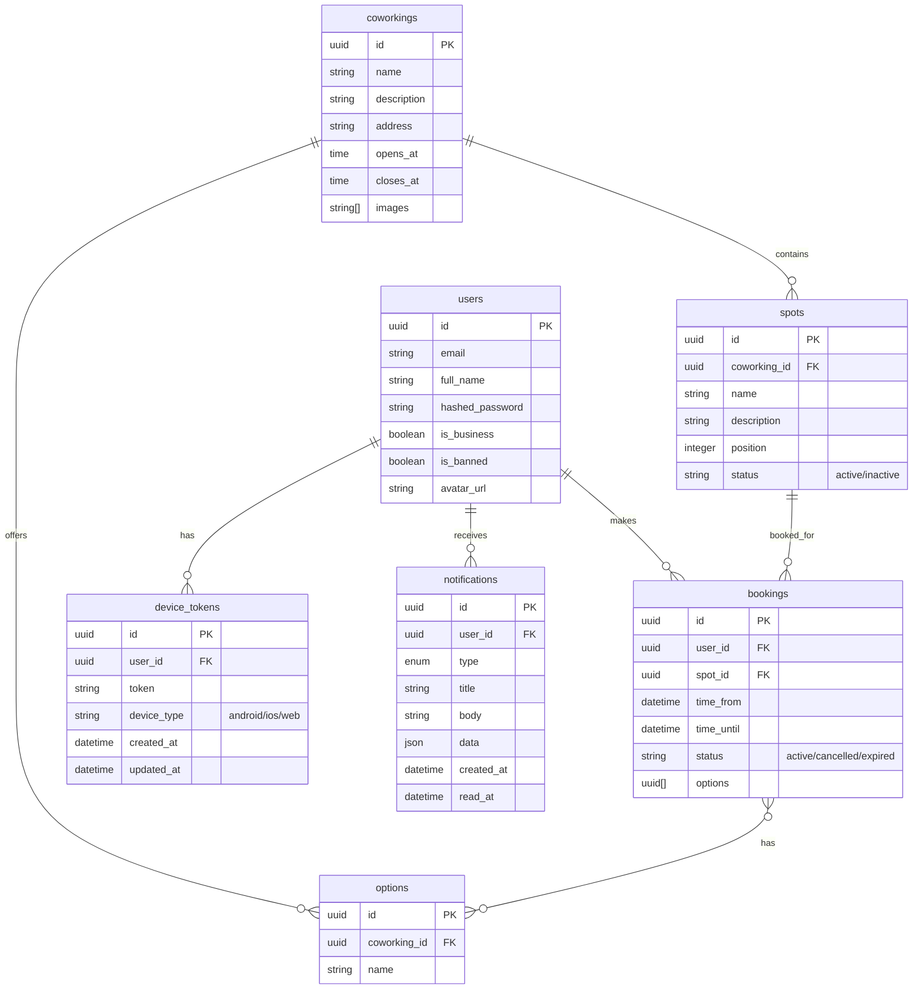
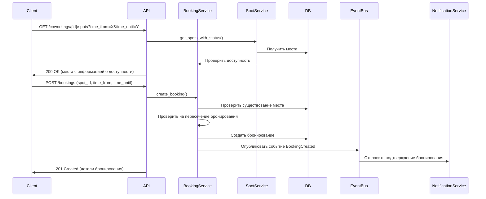
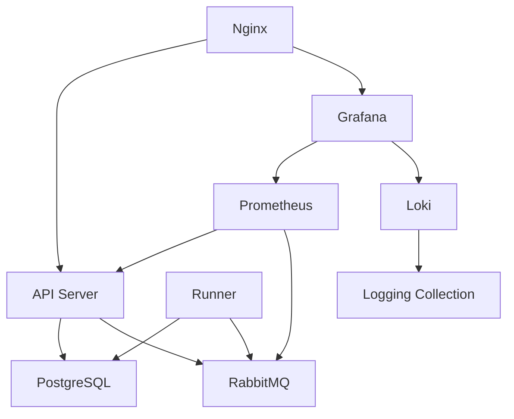
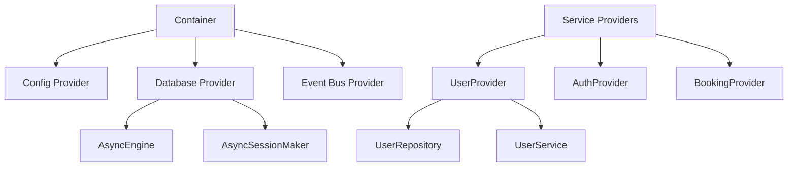
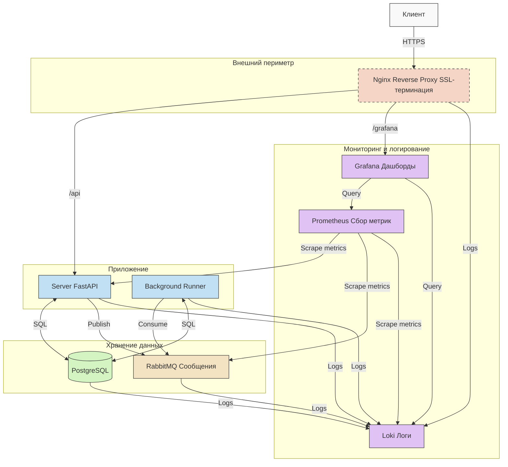
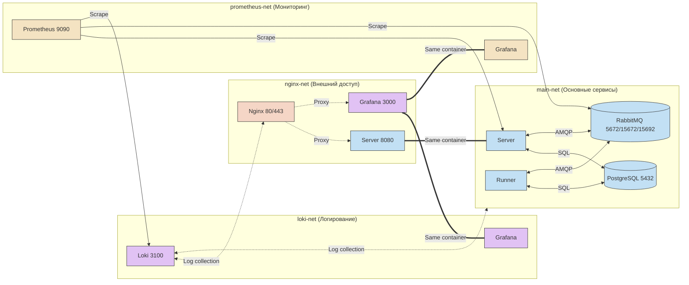
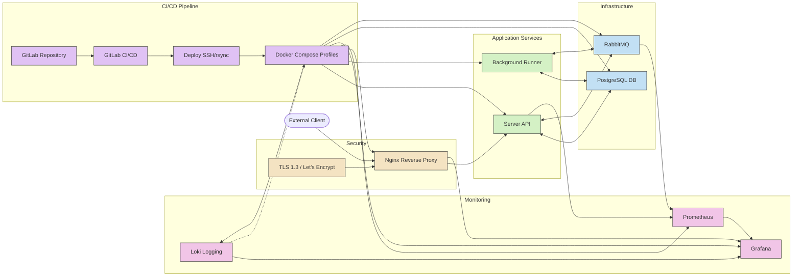

# Архитектура системы бронирования коворкинга

Бэкенд-сервис для системы бронирования коворкинга на Python с FastAPI.
## Ключевые архитектурные принципы

- **Чистая архитектура**: Разделение ответственности между слоями домена, приложения и инфраструктуры
- **DDD (Domain-Driven Design)**: Бизнес-логика организована вокруг доменов с явными границами
- **Внедрение зависимостей**: Использует фреймворк dishka для DI
- **Событийно-ориентированное взаимодействие**: Сервисы взаимодействуют через шину событий
- **Модульная структура**: Функциональность разделена на связанные модули с четкими интерфейсами
### Архитектурные паттерны

- **Репозиторий**: Абстрагирует логику доступа к данным
- **CQRS**: Разделяет операции чтения и записи
- **Инверсия зависимостей**: Высокоуровневые модули не зависят от низкоуровневых
- **Сервисный слой**: Координирует действия между репозиториями и доменом
## Структура проекта

```
backend/
├── src/
│   ├── core/                  # Основная функциональность, используемая во всех модулях
│   │   ├── container.py       # Контейнер внедрения зависимостей
│   │   ├── database.py        # Подключение к базе данных и управление сессиями
│   │   ├── di.py              # Провайдеры внедрения зависимостей
│   │   ├── domain.py          # Базовые доменные сущности и интерфейсы
│   │   ├── error_handlers.py  # Обработчики ошибок для FastAPI
│   │   ├── events.py          # Реализация шины событий
│   │   ├── exceptions.py      # Централизованная обработка исключений
│   │   ├── factories.py       # Фабрики для создания сервисов
│   │   ├── logging.py         # Утилиты для логирования
│   │   ├── settings.py        # Конфигурация приложения
│   │   └── timezone_utils.py  # Утилиты для работы с временными зонами
│   │
│   ├── modules/               # Модули, специфичные для предметной области
│   │   ├── auth/              # Модуль аутентификации
│   │   ├── base/              # Базовый модуль с общими компонентами
│   │   ├── bookings/          # Модуль бронирований
│   │   ├── coworkings/        # Модуль коворкингов
│   │   ├── healthcheck/       # Модуль проверки работоспособности
│   │   ├── notifications/     # Модуль уведомлений
│   │   ├── options/           # Модуль опций
│   │   ├── spots/             # Модуль мест
│   │   ├── storage/           # Модуль хранилища
│   │   └── users/             # Модуль пользователей
│   │
│   ├── entrypoints/           # Точки входа в приложение
│   │   ├── mock/              # Мок данные для разработки и тестирования
│   │   ├── rest/              # REST API сервер (FastAPI)
│   │   └── runner/            # Обработчик событий
│   │
│   └── tests/                 # Тесты (e2e, модульные)
```

## Структура модуля

Каждый модуль следует похожей многослойной структуре:

```
module/
├── adapters/                  # Слой адаптеров
│   └── api/
│       ├── router.py          # Определения маршрутов API (эндпоинты)
│       └── schemas.py         # Pydantic-схемы для валидации и сериализации
│
├── application/               # Слой приложения, реализующий бизнес-процессы
│   ├── commands.py            # Обработчики команд (изменение состояния)
│   ├── queries.py             # Обработчики запросов (чтение данных)
│   └── services.py            # Сервисный слой, координирующий логику приложения
│
├── domain/                    # Ядро домена, содержащее бизнес-правила и логику
│   ├── entities.py            # Доменные сущности
│   ├── events.py              # Доменные события (для event-driven архитектуры)
│   ├── exceptions.py          # Исключения, специфичные для домена
│   ├── repositories.py        # Интерфейсы репозиториев
│   ├── services.py            # Доменные сервисы
│   └── value_objects.py       # Объекты-значения
│
├── infrastructure/            # Слой инфраструктуры
│   ├── event_handlers.py      # Обработчики доменных событий
│   ├── orm/                   
│   │   └── models.py          # Модели SQLAlchemy для хранения данных
│   └── repositories/          # Реализации репозиториев
│       └── {module_name}_repository.py # Конкретная реализация репозитория
│
└── provider.py                # Провайдер DI
```

## Ключевые модули

- **Users**: Управление пользователями
- **Auth**: Аутентификация и токены
- **Coworkings**: Управление коворкингами
- **Spots**: Управление рабочими местами
- **Bookings**: Бронирование мест
- **Notifications**: Уведомления пользователей
- **Options**: Дополнительные опции
- **Storage**: Хранение файлов

## Структура базы данных



## Поток взаимодействия сервисов

### Бронирование места




## Архитектура развертывания



## Внедрение зависимостей



## Общая схема компонентов



## Сетевая архитектура



## CI/CD и безопасность



## API документация

### OpenAPI спецификация
Полная OpenAPI спецификация доступна по ссылке: https://prod-team-41-l4fbsnm0.REDACTED/api/openapi.json

### Swagger UI
Swagger UI: https://prod-team-41-l4fbsnm0.REDACTED/api/docs/

### Работа со Swagger UI

#### Аутентификация
Для авторизованных запросов используйте JWT токен:

1. Получите токен через эндпоинт `/auth/login`, отправив email и пароль
2. Используйте полученный токен в разделе "Authorize" (кнопка в правом верхнем углу Swagger UI)
3. Введите токен в форму

#### Примеры запросов

##### Создание пользователя
```json
{
  "email": "user@example.com",
  "full_name": "Test User",
  "password": "password123",
  "is_business": false
}
```

## Тестирование


## CI/CD Pipeline

